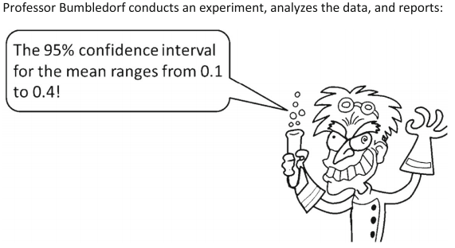
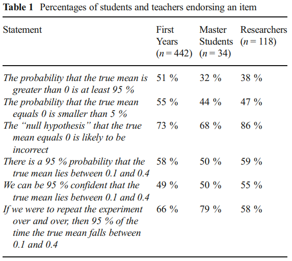

# Today

----
<!-- add div element table of content for javascript to fill -->
<div id="toc", align="left"></div>

# Replication crisis {.section}

## What do researchers think?
<br>
```{r, fig.align = 'center', out.width='60%', echo = FALSE}
knitr::include_graphics('figures/Baker 2016.jpeg')
```
<section style="text-align: right;">
@baker2016
</section>

## Causes for the crisis?

<span style="color:red">Fraud</span>
<br><br>

- Diederik Stapel, social psychologist. Suspended in 2011.
<br>
[Fabricating and manipulating data](https://www.nytimes.com/2013/04/28/magazine/diederik-stapels-audacious-academic-fraud.html?pagewanted=1&_r=0&src=recg).
<br><br>
- Marc Hauser, psychologist at Harvard. Resigned in 2011.
[Scientific misconduct](https://www.bostonglobe.com/metro/2014/05/29/internal-harvard-report-shines-light-misconduct-star-psychology-researcher-marc-hauser/maSUowPqL4clXrOgj44aKP/story.html).
<br><br>
- Jens Förster, social psychologist. Resigned in 2017.
<br>
[Data tampering](https://retractionwatch.com/2017/12/12/psychologist-fire-leaves-university-start-private-practice/).
<br><br>
- ...

## Causes for the crisis?

<span style="color:red">Questionable research practices</span><br>
[QRPs; @john2012; @schimmack2015]
<br><br>

- Omit some DVs.
- Omit some conditions.
- Peeking: Sequential testing --- Look and decide:
    * $p > .05$: Collect more.
    * $p < .05$: Stop.
- Only report $p<.05$ results.
- $p$-hacking: E.g.,
    - Exclusion of outliers depending on whether $p<.05$.
    - $p = .054 \longrightarrow p = .05$.
- HARKing [@kerr1998]: Convert exploratory results into research questions.
- ...

## Causes for the crisis?

<span style="color:red">Researcher's degrees of freedom</span>
<br><br>

- Researchers have a multitude of decisions to make (experiment design, data collection, analyses performed);
<br>
@wicherts2016, @steegen2016.
<br><br>
- It is very possible to manipulate results *in favor* of one's interests.
<br><br>
- This is now known as *researcher's degrees of freedom* [@simmons2011].
<br><br>
- Consequence: Inflated false positive findings [@ioannidis2005].

## Causes for the crisis? {.scrollable}

<span style="color:red">Turning exploratory into confirmatory analysis</span>
<br><br>

> "(...) [L]et us (...) become intimately familiar with (...) the data. Examine them <span style="color:#729252">from every angle</span>. Analyze the sexes separately. Make up new composite indices. <span style="color:#729252">If a datum suggests a new hypothesis, try to find further evidence for it elsewhere in the data.</span> If you see dim traces of interesting patterns, try to reorganize the data to bring them into bolder relief. If there are participants you don't like, or trials, observers, or interviewers who gave you anomalous results, <span style="color:#729252">drop them</span> (temporarily). <span style="color:#729252">Go on a fishing expedition for something-- anything-- interesting.</span>"

<section style="text-align: right;">
@bem2004
</section>


This is not OK *unless* the exploration is explicity stated.

## Causes for the crisis? {.scrollable}

<span style="color:red">Turning exploratory into confirmatory analysis</span>
<br><br>

[Brian Wansink's description](https://web.archive.org/web/20170312041524/http:/www.brianwansink.com/phd-advice/the-grad-student-who-never-said-no) of the efforts of a visiting Ph.D student:

> I gave her a <span style="color:#729252">data set</span> of a self-funded, failed study which had <span style="color:#729252">null results</span> (...). I said, "This cost us a lot of time and our own money to collect. <span style="color:#729252">There’s got to be something here</span> we can salvage because it’s a cool (rich & unique) data set." I had three ideas for potential Plan B, C, & D directions (since Plan A had failed). I told her what the analyses should be and what the tables should look like. I then asked her if she wanted to do them.

> Every day she came back with puzzling new results, and every day we would scratch our heads, ask "Why," and <span style="color:#729252">come up with another way to reanalyze the data</span> with yet another set of plausible hypotheses. Eventually <span style="color:#729252">we started discovering solutions</span> that held up regardless of how we pressure-tested them. I outlined the first paper, and she wrote it up (...). This happened with a second paper, and then a third paper (which was one that was based on her own discovery while digging through the data).

## Causes for the crisis?

<span style="color:red">Lack of replications</span>
<br><br>

Until very recently [@makel2012].
<br>

```{r, fig.align = 'center', out.width='60%', echo = FALSE}
knitr::include_graphics('figures/Makel 2012.png')
```

- Very low rate of replications in Psychology (estimated ~1%).
- Until 2012, majority of replications were actually <span style="color:red">successful</span>!!
- However, in most cases both the original and replication studies shared authorship...
- Conflict of interest?...

## Famous [replication failures](https://bit.ly/2y7qeer)
- The [Marshmallow Test](https://www.vox.com/science-and-health/2018/6/6/17413000/marshmallow-test-replication-mischel-psychology) [@watts2018]
- [Ego depletion](https://digest.bps.org.uk/2017/12/14/strongest-evidence-yet-for-ego-depletion-the-idea-that-self-control-is-a-limited-resource/) [@hagger2016; @vadillo2018; @friese2019]
- [Power posing](https://www.ted.com/talks/amy_cuddy_your_body_language_shapes_who_you_are#t-543464) [@ranehill2015]
- The [Stanford Prison Experiment](https://medium.com/s/trustissues/the-lifespan-of-a-lie-d869212b1f62) [@reicher2006;@griggs2014]
- The [facial feedback hypothesis](https://digest.bps.org.uk/2016/09/01/no-reason-to-smile-another-modern-psychology-classic-has-failed-to-replicate/) [@wagenmakers2016]
- [Newborn babies’ imitation](https://digest.bps.org.uk/2016/05/20/a-classic-finding-about-newborn-babies-imitation-skills-is-probably-wrong/) [@oostenbroek2016]
- The [blocking effect](https://www-nature-com.proxy-ub.rug.nl/news/psychologists-fail-to-replicate-well-known-behaviour-linked-to-learning-1.20659) [@maes2016]
- [The stereotype threat](https://www.nationalreview.com/corner/another-replication-failure-stereotype-threat-is-probably-empty/) [@flore2019]
- The [facial expression](https://www.popsci.com/article/science/facial-expressions-arent-universal-we-thought/#page-2) [@gendron2018]
- [ESP](https://www.theguardian.com/science/2012/mar/15/precognition-studies-curse-failed-replications), of course! [@ritchie2012;@galak2012]
- The Mozart Effect [@steele1999; @mckelvie2002]
- ...

## Is it really *that* bad?...  {.scrollable}
[Yes](https://www.westernalliance.org.au/2018/05/restoring-trust-in-science-what-are-questionable-research-practices).

- @martinson2005: "Scientists behaving badly".
- @fanelli2009: Meta-analysis shows evidence of science misconduct.
- @john2012: Evidence for QRPs in psychology.
- @mobley2013: Reported evidence of pressure to *find* significant results.
- @agnoli2017: Evidence of QRPs, now in Italy.
- @fraser2018: In other fields of science.
<br><br>

Interestingly, science misconduct has been a longtime concern [see @babbage1830].
<br><br>

## Is it really *that* bad?...

For the sake of balance, not everyone agrees [e.g., @fiedler2016].

# Use / abuse / misuse of Statistics  {.section}

## $p$ values

## Definition

> Probability of an effect at least as extreme as the one we observed, *given that $\mathcal{H}_0$ is true*.

<br><br>
\[\fbox{$ p\text{-value} = P\left(X_\text{obs} \text{ or more extreme}|\mathcal{H}_0\text{ true}\right) $}\]
<br><br>

The definition is simple enough, right?...

## Test yourself
Consider the following statement [@oakes1986; @falk1995; @haller2002; @gigerenzer2004]:

> *Suppose you have a treatment that you suspect may alter performance on a certain task. You compare the
means of your control and experimental groups (say, 20 subjects in each sample). Furthermore, suppose you
use a simple <span style="color:red">independent means $t$-test</span> and your result is <span style="color:red">significant</span> ($t = 2.7$, $df = 18$, $p = .01$). Please mark
each of the statements below as "true" or "false."* False *means that the statement does not follow logically
from the above premises. Also note that several or none of the statements may be correct.*

## Test yourself
```{r, fig.align = 'center', out.width='100%', echo = FALSE}
knitr::include_graphics('figures/Gigerenzer p values.png')
```

## Test yourself

Try it!

<center>
[http://rebrand.ly/pvalue](http://rebrand.ly/pvalue){target="_blank"}
</center>
<br>

```{r, fig.align = 'center', out.width='40%', echo = FALSE}

```

<!-- Poll here: http://www.polljunkie.com/poll/yezkij/what-is-a-p-value/admin -->
<!-- Shorter: https://rebrand.ly/pvalue -->
<!-- Available only until 31 August 2019 -->

<!-- ## Results -->
<!-- **All** statements are <span style="color:red">incorrect</span>. -->

## Results
But how did students and teachers perceive these statements?

```{r, fig.align = 'center', out.width='40%', echo = FALSE}
knitr::include_graphics('figures/Gigerenzer p values 2.png')
```

This was in 2004. But things did not improve since...

## Goodman (2008)

```{r, fig.align = 'center', out.width='60%', echo = FALSE}
knitr::include_graphics('figures/Goodman.png')
```
<br>

```{r, fig.align = 'center', out.width='85%', echo = FALSE}
knitr::include_graphics('figures/Goodman2.png')
```

## Greenland et al. (2016)

```{r, fig.align = 'center', out.width='80%', echo = FALSE}
knitr::include_graphics('figures/Greenland.png')
```

<br><br><br>

This paper expands @goodman2008 and elaborates on <span style="color:red">25 misinterpretations</span>.

## *The American Statistician* (2019)
Special issue with 43 (!!) papers [@wasserstein2019].

<p align="center"><span style="color:red">Moving to a world beyond "$p<.05$"</span></p>

## Confidence intervals

## A better alternative?
- Confidence intervals (CIs) have been often advocated as the best inferential alternative to NHST.
<br><br>
- Recall, for example the Wilkinson Task Force [@wilkinson1999]:

> "(...) it is hard to imagine a situation in which a dichotomous accept–reject decision is better than reporting an actual $p$ value or, better still, a <span style="color:red">confidence interval</span>.”

<section style="text-align: left;">
- But, are CIs really a better alternative?
</section>

## Definition {.scrollable}
See, for instance, @hoekstra2014.

> A (say) 95% CI is a numerical interval found through a procedure that, if repeated across a series of hypothetical data, leads to an interval covering the true parameter 95% of the times.

- A CI indicates a property of the performance of the <span style="color:red">procedure</span> used to compute it:<br>
How is the <span style="color:red">procedure</span> expected to perform in the long run?
<br><br>
- A CI for a parameter is constructed <span style="color:red"> around the parameter's estimate</span>.
<br><br>
- However, a CI does not (really <span style="color:red">not</span>!) directly indicate a property of the parameter being estimated!
<br><br>

Confused?<br>
You're not alone...

## Test yourself
From @hoekstra2014, mimicking the $p$ value study by @gigerenzer2004.

```{r, fig.align = 'center', out.width='80%', echo = FALSE}

```

## Test yourself
```{r, fig.align = 'center', out.width='80%', echo = FALSE}

```

## Test yourself

Try it!

<center>
[http://rebrand.ly/confint](http://rebrand.ly/confint){target="_blank"}
</center>
<br>

```{r, fig.align = 'center', out.width='40%', echo = FALSE}

```

<!-- Poll here: http://www.polljunkie.com/poll/ykmrid/what-is-a-confidence-interval-hoekstra-et-al-2014 -->
<!-- Shorter: https://rebrand.ly/confint -->
<!-- Available only until 31 August 2019 -->

<!-- ## Results -->
<!-- **All** statements are <span style="color:red">incorrect</span>. -->

## Results
But how did students and teachers perceive these statements?

```{r, fig.align = 'center', out.width='55%', echo = FALSE}

```

## What would be correct, then?... {.scrollable}
> “If we were to repeat the experiment over and over, then 95% of the time the confidence intervals contain the true mean.”

How informative is this?!
<br><br>

Mental note:<br>
Remember this when interpreting <span style="color:red">Bayesian credible intervals</span> in part 2 of today's workshop!
<br><br>

For completeness, not everyone agrees with the Hoekstra study [@garcia-perez2016; @miller2016; see also a reply by @morey2016]. Also the very same authors of the Hoesktra study [@morey2019]!


# References 
##  {.scrollable}
----

